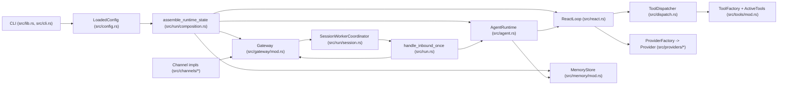
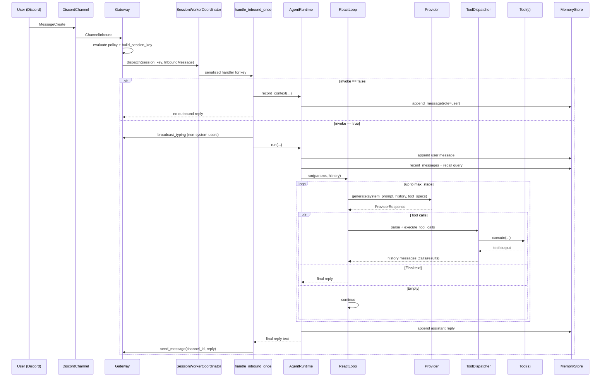
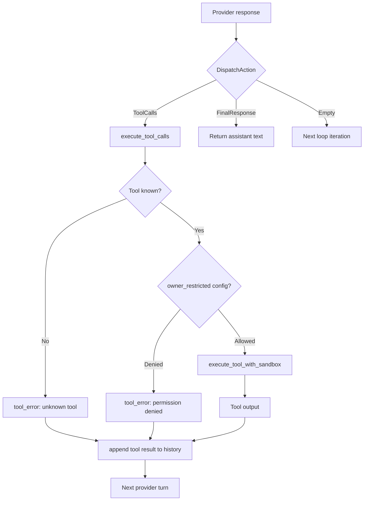

# SimpleClaw

SimpleClaw is a Rust multi-agent runtime that connects channel events (currently Discord) to agent execution loops with:

- layered prompt assembly
- short-term and long-term SQLite memory
- provider-native or XML tool calling
- tool sandbox controls (`read`/`edit` WASM, `exec` host or sandbox-runtime-rs)
- per-session concurrency control

This README is an implementation-level architecture deep dive, focused on message lifecycle.

## Runtime Architecture



## Important Runtime Types

### Ingress and routing
- `Channel` trait (`src/channels/mod.rs`): `listen`, `send_message`, `broadcast_typing`.
- `DiscordChannel` (`src/channels/discord.rs`): maps Serenity events to `ChannelInbound`.
- `Gateway` (`src/gateway/mod.rs`): spins one listener task per channel, normalizes inbound, owns the inbound queue.
- `InboundMessage` (`src/channels/types.rs`): canonical message envelope used by the runtime.

### Inbound policy and session identity
- `InboundConfig::resolve` (`src/config.rs`): hierarchical policy resolution (global -> channel-kind -> workspace -> channel; DM override path).
- `classify_inbound` (`src/channels/policy.rs`): computes `ingest_for_context`, `allow_invoke`, `target_agent_id`.
- `build_session_key` (`src/gateway/session.rs`):
  - DM: `agent:<agent_id>:main`
  - non-DM Discord: `agent:<agent_id>:discord:<channel_id>`

### Orchestration
- `SessionWorkerCoordinator<T>` (`src/run/session.rs`): guarantees serialized processing per `session_key` and concurrency across different keys.
- `handle_inbound_once` (`src/run.rs`): top-level turn handler, including passive-ingest vs invoke behavior.
- `AgentRuntime` (`src/agent.rs`): persists inbound user message, builds history and system prompt, invokes `ReactLoop`, persists assistant reply.
- `ReactLoop` (`src/react.rs`): iterative provider/tool loop up to `max_steps`.

### Tooling
- `ToolFactory` + `ActiveTools` (`src/tools/mod.rs`): resolves enabled built-ins plus dynamic skill tools.
- `ToolDispatcher` (`src/dispatch.rs`):
  - `NativeDispatcher`: consumes provider-native function/tool calls.
  - `XmlDispatcher`: fallback protocol using `<tool_call>` blocks in text.
- `ToolExecEnv` (`src/tools/mod.rs`): execution context passed to tools (identity, sandbox mode, memory, process manager, completion route).
- `ProcessManager` (`src/tools/mod.rs`): background process lifecycle + completion watcher that re-injects synthetic inbound events.

### Provider and memory
- `ProviderFactory` / `ProviderRegistry` (`src/providers/registry.rs`): provider instantiation from config (Gemini currently).
- `GeminiProvider` (`src/providers/gemini.rs`): `generateContent` adapter, including function declarations and parsing tool calls.
- `MemoryStore` (`src/memory/mod.rs`):
  - short-term DB: `sessions`, `messages`
  - long-term DB: `ltm_facts`, `ltm_facts_vec`
  - semantic recall query path and long-term memory tools.

## Message Lifecycle (Step-by-Step)



## Lifecycle Nuances That Matter

### 1) Ingest vs invoke split
- `ingest_for_context=false`: message is dropped before queueing.
- `ingest_for_context=true, invoke=false`: message is stored as context only (no model run, no reply).
- In DMs, ingest follows invoke (`ingest_for_context = allow_invoke`), so denied DMs are dropped entirely.

### 2) Ordering guarantees
- Per-session ordering is strict because one worker processes one session key sequentially.
- Different session keys run concurrently.
- Workers expire after idle timeout (5 minutes), then respawn on next message.

### 3) Prompt construction per turn
- Base prompt: concatenated workspace files in this order:
  - `IDENTITY.md`, `AGENT.md`, `USER.md`, `MEMORY.md`, `SOUL.md`
- Optional memory recall appends a scored long-term context section.
- Caller context is always injected (`CURRENT SPEAKER` with user id/name).

### 4) Tool execution security controls
- Owner restriction is configured per built-in tool via `owner_restricted` (default: `true`).
- Dynamic skill tools are not owner-restricted.
- If `runtime.owner_ids` is empty, owner-restricted tools fail as misconfigured.
- `tools.summon.allowed` is a strict allowlist. Empty or omitted means no summon targets are allowed.
- Sandbox gate (`tools/sandbox.rs`) enforces sandbox-aware tools when `sandbox=on`.

### 5) Background process completion is an inbound event
- `exec` with `background=true` registers a completion watcher.
- On completion, watcher sends a synthetic `InboundMessage` with:
  - `user_id="system"`
  - `invoke=true`
  - content: `[background process completed] ...`
- This re-enters the same session pipeline and can trigger follow-up model behavior.

## Tooling Architecture



Built-in tools are registered in `src/tools/builtin/mod.rs`:
- `memory`, `memorize`, `forget`
- `summon`, `task`
- `web_search`, `web_fetch`, `clock`
- `read`, `edit`, `exec`, `process`

Skill tools are loaded from `skills/<skill_id>/SKILL.md` (agent workspace first, then global `~/.simpleclaw/skills`).

## Configuration Model (Current)

There is a single global config file: `~/.simpleclaw/config.yaml`.

Agent-specific behavior is embedded in `agents.list[*]` entries:
- workspace path
- provider override
- sandbox mode
- enabled tools
- enabled skills

Secrets in config must be `${secret:<name>}` and resolve from:
1. environment variable `<name>`
2. `~/.simpleclaw/secrets.yaml`

## Storage Layout

- Runtime state: `~/.simpleclaw/`
- Logs:
  - `~/.simpleclaw/logs/service.log`
  - `~/.simpleclaw/logs/service.jsonl`
- PID file: `~/.simpleclaw/run/service.pid`
- Prompt files: inside each agent workspace
- Memory databases per agent workspace:
  - `<workspace>/.simpleclaw/memory/lraf.db`
  - `<workspace>/.simpleclaw/memory/lraf_long_term.db`

## Operational Commands

```bash
cargo build
cargo test

cargo run
cargo run -- system run
cargo run -- system start
cargo run -- system stop
cargo run -- status
cargo run -- logs --follow

cargo run -- providers list
cargo run -- models list
cargo run -- agent memory --agent <id> --memory both --limit 20
```

## Sandbox Artifacts

Build WASM guests for sandboxed `read`/`edit`:

```bash
cargo build --package read_tool --package edit_tool --target wasm32-wasip1 --release
```

## Linux Integration Tests (Podman)

Run Linux-only sandbox integration tests from macOS using Podman:

```bash
./scripts/linux_integration_podman.sh
```

To test against a local checkout of `sandbox-runtime-rs`:

```bash
SANDBOX_RUNTIME_PATH=/absolute/path/to/sandbox-runtime-rs \
  ./scripts/linux_integration_podman.sh
```

Install/uninstall helpers:

```bash
./scripts/install.sh
./scripts/install.sh --debug
./scripts/uninstall.sh
./scripts/uninstall.sh --stop
```
